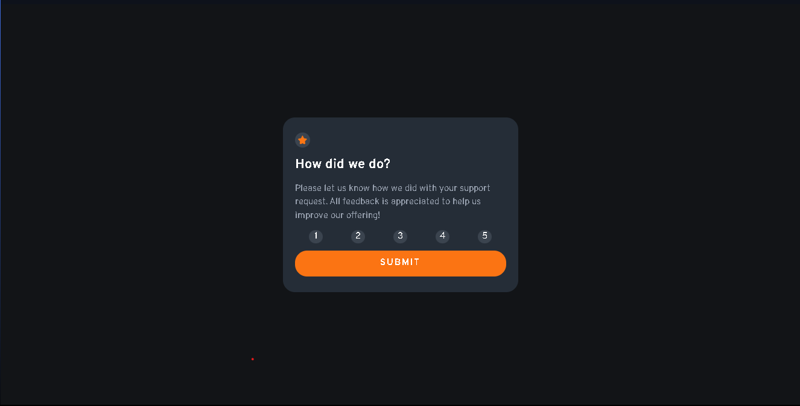
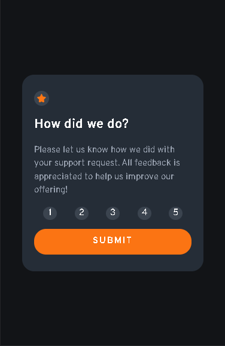
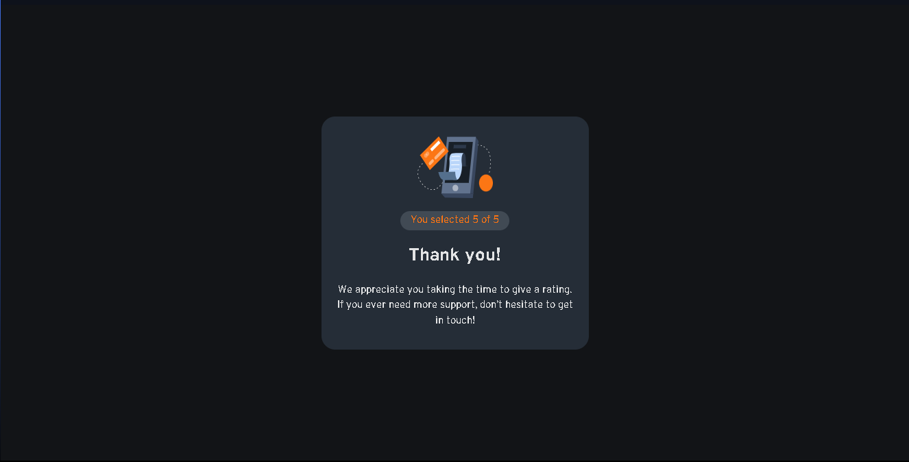
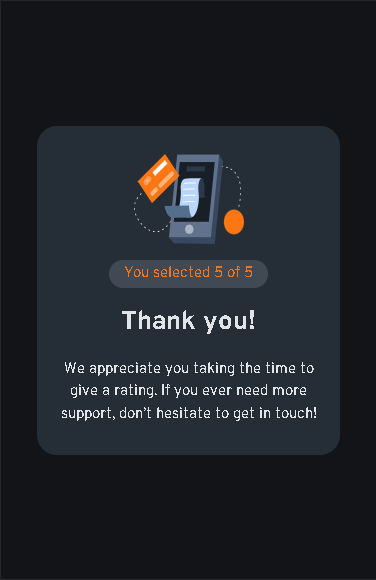

# Interactive rating component solution

## Table of contents

- [Interactive rating component solution](#interactive-rating-component-solution)
  - [Table of contents](#table-of-contents)
  - [Overview](#overview)
    - [The challenge](#the-challenge)
    - [Screenshot](#screenshot)
    - [Links](#links)
  - [My process](#my-process)
    - [Built with](#built-with)
    - [What I learned](#what-i-learned)
  - [Author](#author)

## Overview

### The challenge

Users should be able to:

- View the optimal layout for the app depending on their device's screen size
- See hover states for all interactive elements on the page
- Select and submit a number rating
- See the "Thank you" card state after submitting a rating

### Screenshot

 
 
 
 

### Links

- Solution URL: [Interactive_rating_component](https://github.com/LastYasuoUwU/Interactive_rating_component)
- Live Site URL: [Interactive_rating_component](https://lastyasuouwu.github.io/Interactive_rating_component/)

## My process

### Built with

- [Vitejs](https://vitejs.dev/)

### What I learned

- set up project using vitejs.
- set new font-family and use it.
- focus property of "a" tag.
- use react-router-dom to pass value from page to another.

## Author

- Frontend Mentor - [@LastYasuoUwU](https://www.frontendmentor.io/profile/LastYasuoUwU)

